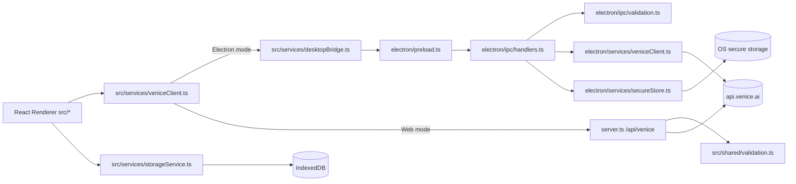

# AGENT_REINITIALIZATION.md

Last refreshed: 2026-05-28
Maintainer scope: AI coding agents and senior engineers onboarding quickly
Source policy: Every project-specific statement is tagged `[VERIFIED]` or `[INFERRED]`

---

## Investigation Summary

- The highest-churn files across history are `src/services/veniceClient.ts`, `src/modules/SettingsModule.tsx`, `server.ts`, `electron/main.ts`, and `src/App.tsx`; this is where behavioral risk concentrates. `[VERIFIED]`
- The project has shifted from early web-proxy-first architecture to direct IPC transport in Electron, with shared validation (`src/shared/validation.ts`) used by both IPC and web proxy paths. `[VERIFIED]`
- Packaging and release automation now targets both Windows and macOS, with artifact verification and SHA-256 checksums in workflows and scripts. `[VERIFIED]`
- Current lint posture allows warnings and enforces a budget gate via `npm run lint:eslint` (`--max-warnings=96`), while strict TypeScript remains enabled in both renderer and Electron configs. `[VERIFIED]`
- There is no existing `AGENT_REINITIALIZATION.md` in the repo; `AGENTS.md` is the current long-form agent guide and has been superseded by this file for deep context. `[VERIFIED]`

---

## 1) Current High-Level Architecture & Mental Model

### 1.1 Dominant mental model

- Venice Forge is a dual-mode app:
  - Electron desktop mode (production-oriented).
  - Browser web mode (development-oriented). `[VERIFIED]`
- The renderer codebase is shared; transport is the key mode switch:
  - Electron: renderer -> preload bridge -> IPC handlers -> main-process Venice HTTPS client.
  - Web: renderer -> Express proxy `/api/venice/*` -> Venice HTTPS API. `[VERIFIED]`
- Security boundaries are explicit:
  - Renderer has no Node.js access in Electron (`contextIsolation: true`, `nodeIntegration: false`, `sandbox: true`).
  - Allowed endpoints/methods are constrained in shared validation. `[VERIFIED]`

### 1.2 Runtime flow (real modules only)



All nodes above exist as concrete files in repo. `[VERIFIED]`

### 1.3 Core data flows

| Flow | Primary files | Invariants |
|---|---|---|
| API request/response | `src/services/veniceClient.ts`, `src/shared/validation.ts`, `electron/ipc/validation.ts`, `server.ts` | Only allowlisted endpoints and methods are accepted; retry logic targets `429/500/503`. `[VERIFIED]` |
| Streaming chat | `src/services/veniceClient.ts`, `electron/preload.ts`, `electron/ipc/handlers.ts`, `electron/services/veniceClient.ts` | Streaming only for `POST /chat/completions`; delta transport keyed by `signalId`. `[VERIFIED]` |
| Local state lifecycle | `src/App.tsx`, `src/state/appReducer.ts`, modules in `src/modules/` | One global reducer; modules receive `{ state, dispatch }`; settings persisted into IndexedDB. `[VERIFIED]` |
| Theme system | `src/theme/*`, `src/App.tsx`, `src/components/ThemeMaker.tsx` | Token-based CSS variables; canonical state in IndexedDB; bootstrap cache in localStorage for FOUC prevention. `[VERIFIED]` |
| Persistent local data | `src/services/storageService.ts`, `src/services/cryptoService.ts`, `src/services/exportImport.ts` | Store set is controlled by `STORE_NAMES`; encrypted wrapper used for selected stores; import/export size-limited and schema-checked. `[VERIFIED]` |
| API key lifecycle | `electron/services/secureStore.ts`, `electron/ipc/handlers.ts`, `src/services/desktopBridge.ts` | Desktop mode stores key in safeStorage-backed file; renderer cannot read raw key. `[VERIFIED]` |
| Diagnostics/logging | `src/services/veniceClient.ts`, `src/modules/DiagnosticsModule.tsx`, `electron/services/logger.ts` | Request diagnostics emitted via reducer actions; logs redact sensitive values. `[VERIFIED]` |

### 1.4 Architecture invariants that matter for edits

- Renderer modules should call `veniceFetch`/`veniceStreamChat`; not direct `fetch('/api/venice/...')` in module code. `[VERIFIED]`
- Any new Venice endpoint requires updates in both shared allowlist and IPC validation gate (and proxy behavior if web mode needed). `[VERIFIED]`
- Any new IPC feature requires preload + IPC handler + validation + desktop bridge surface alignment. `[VERIFIED]`
- Global state shape and mutation semantics are reducer-driven; side effects sit in services/modules. `[VERIFIED]`

---

## 2) Key Domain Concepts & Business Logic

### 2.1 Domain vocabulary

| Concept | Meaning in this codebase | Where encoded |
|---|---|---|
| Dual mode | Same renderer running either against IPC or web proxy transport | `src/services/desktopBridge.ts`, `src/services/veniceClient.ts`, `server.ts` |
| Venice request allowlist | Explicit endpoint + method allowlist, pair-validated | `src/shared/validation.ts`, `electron/ipc/validation.ts`, `server.ts` |
| Fallback models | Built-in models used when live model fetch unavailable | `src/constants/venice.ts`, `src/state/appReducer.ts` |
| Diagnostics entry | Per-request metadata record in reducer log | `src/services/veniceClient.ts`, `src/state/appReducer.ts` |
| Encrypted IndexedDB wrappers | Stored object with `{ id, timestamp, data, _isEncryptedWrapper }` for encrypted stores | `src/services/storageService.ts` |
| Export envelope | `{ version, exportedAt, appVersion, data }` payload with filtered stores | `src/services/exportImport.ts` |

All concept mappings above are directly visible in file implementations. `[VERIFIED]`

### 2.2 Business logic that is easy to break

- Model selection is auto-corrected when a previously selected model disappears after refresh; reducer emits warning toasts and switches selection. `[VERIFIED]`
- Web chat search toggle (`webSearch`) has legacy coercion behavior (`boolean` -> enum string) to avoid malformed payload regressions. `[VERIFIED]`
- Upload handling includes raw-byte and serialized-byte boundaries; serializer estimates base64 overhead. `[VERIFIED]`
- Decrypt failures are intentionally non-fatal: records are skipped and warning surfaced; app continues loading remaining data. `[VERIFIED]`

### 2.3 Product-level assumptions inferred from code

- Desktop mode is treated as the “real” secure transport, while web mode exists primarily for development/test convenience. `[INFERRED]`
- The project optimizes for resilience and user continuity over hard-fail behavior when local persisted records become unreadable. `[INFERRED]`

---

## 3) Major Recent Changes & Architectural Decisions

Grounding: derived from `git log --oneline -50` plus commit stats/details.

| Change | Date/Commit | Why | Tradeoff | Impact on agents |
|---|---|---|---|---|
| Refactor UI styles and accessibility | 2026-05-28 `b18b853` | Consolidate styling/a11y improvements and remove legacy CSS cruft | Large UI diffs increase merge conflict risk in modules/components | Avoid broad UI rewrites in same PR as logic fixes; keep behavioral edits isolated. `[VERIFIED]` |
| Tailwind Premium Dark Glass migration | 2026-05-28 `f87025a` | Move to utility-first UI styling and consistent aesthetic | Large CSS/JSX churn; class-heavy diffs are noisy | Prefer existing Tailwind patterns; do not reintroduce old CSS abstractions. `[VERIFIED]` |
| Focus trap and modal accessibility hardening | 2026-05-28 `de01def` | Close keyboard/ARIA gaps and unify modal behavior | Additional hook coupling and event ordering complexity | Reuse `useFocusTrap`; avoid ad hoc modal key handlers. `[VERIFIED]` |
| Central AppConfig schema introduced | 2026-05-28 `a4f5a19` | Consolidate env parsing and validation | Indirection can hide runtime defaults | Read `src/shared/configSchema.ts` before adding env vars; keep bounds explicit. `[VERIFIED]` |
| Auto-update integration (`electron-updater`) | 2026-05-28 `22b7cdc` | Add in-app update checks/download/install flow | More IPC surface + release workflow complexity | New update channels must be wired across preload/bridge/UI/tests. `[VERIFIED]` |
| macOS release support and verification | 2026-05-28 `6a9b740`, `a8c8c9b` | Dual-platform packaging and artifact checks | More CI branches and signing paths | Validate platform-specific scripts/workflows before release changes. `[VERIFIED]` |
| Endpoint-method pair enforcement | 2026-05-22 `9385d66` | Prevent method misuse on allowlisted endpoints | Slightly stricter behavior may break permissive clients | Keep `VENICE_ENDPOINT_METHODS` authoritative and synced. `[VERIFIED]` |
| Web mode key handling switched server-side | 2026-05-23 `6af3f1b` | Prevent web renderer local key usage | Web mode cannot test arbitrary user keys from UI | Don’t add web local key storage without explicit security decision. `[VERIFIED]` |
| Direct IPC transport hardened in Electron | 2026-05-20 `3f0f15c` | Remove loopback proxy dependence in desktop mode | More main-process complexity | Treat IPC validation as security boundary; tests are non-optional for changes. `[VERIFIED]` |
| Electron migration from web-only app | 2026-05-20 `fefd60f` (+ merge `c86985a`) | Desktop distribution + secure storage + release packaging | Increased code surface and dual-runtime complexity | Always reason by runtime mode; browser-only assumptions are often wrong. `[VERIFIED]` |

No structural change claims above are based on unstated PR metadata. `[VERIFIED]`

---

## 4) Current Folder Structure & File Responsibilities

### 4.1 Current top-level responsibilities

| Path | Responsibility today |
|---|---|
| `src/` | Renderer app: modules, state, services, shared TS types/utilities. `[VERIFIED]` |
| `electron/` | Main process bootstrap, secure IPC boundary, secure store, updater hooks. `[VERIFIED]` |
| `server.ts` | Express proxy + security headers + allowlist/rate-limit/circuit breaker for web mode. `[VERIFIED]` |
| `.github/workflows/` | CI + Windows release + macOS release pipelines. `[VERIFIED]` |
| `scripts/` | Build/release support (icon generation, dist verification, checksums, CJS package shim). `[VERIFIED]` |
| `docs/` | Release/security/platform/support documentation. `[VERIFIED]` |

### 4.2 Critical file ownership map (practical, not exhaustive)

| File | Role | Edit risk |
|---|---|---|
| `src/services/veniceClient.ts` | Transport abstraction + retries + diagnostics + stream parsing + form serialization | Very high |
| `src/theme/*.ts` | Theme token types, built-in palettes, CSS variable application, WCAG contrast utilities | Medium |
| `src/state/appReducer.ts` | Global state transitions and model fallback behavior | High |
| `src/App.tsx` | App bootstrapping, hydration, bridge init, tab routing | High |
| `src/hooks/useThemeLifecycle.ts` | Theme hydration, DOM application, bootstrap cache sync | Medium |
| `src/hooks/useSettingsPersistence.ts` | Debounced IndexedDB settings save | Medium |
| `src/hooks/useNetworkStatus.ts` | Browser online/offline event bridge | Low |
| `src/theme/applyTheme.ts` | Maps semantic tokens to CSS variables and resolves initial theme | Medium |
| `electron/main.ts` | Window security settings, CSP, navigation policy | Very high |
| `electron/ipc/validation.ts` | Main security gate for renderer->main requests | Very high |
| `electron/ipc/handlers.ts` | IPC endpoint bindings + diagnostics/files/update wiring | High |
| `server.ts` | Web mode security and transport controls | Very high |
| `src/services/storageService.ts` | IndexedDB encryption wrapper, decrypt-failure handling | High |

### 4.3 Today vs. previously (git-grounded only)

| Area | Today | Previously | Evidence |
|---|---|---|---|
| Desktop transport | direct IPC to main process Venice client | loopback proxy / older bridge pathways | `3f0f15c`, `fefd60f` remove/rework proxy path for Electron `[VERIFIED]` |
| Release targets | Windows + macOS workflows with verification | Windows-first / earlier narrower setup | `6a9b740`, `a8c8c9b`, `a4f5a19` `[VERIFIED]` |
| UI system | Tailwind v4 utility-heavy classes | older CSS-heavy styling | `f87025a`, `b18b853` `[VERIFIED]` |

No additional “old vs new” claims are made without commit support. `[VERIFIED]`

---

## 5) Core Patterns, Conventions & Coding Standards

### 5.1 Patterns enforced by code structure

- Global state is reducer-centric (`useReducer` + Immer) with discriminated actions. `[VERIFIED]`
- Module components are function declarations in `src/modules/`; services hold transport/storage logic. `[VERIFIED]`
- Desktop-vs-web behavior should be routed through bridge/client abstractions (`isElectron`, `desktop*` wrappers), not scattered runtime checks everywhere. `[VERIFIED]`
- Safety gates are layered:
  - shared validation allowlist;
  - main-process IPC validation;
  - proxy validation for web mode. `[VERIFIED]`

### 5.2 Error-handling conventions

- Renderer transport normalizes HTTP/API errors to user-facing strings and diagnostics entries. `[VERIFIED]`
- IPC handler failures are sanitized (`redactErrorMessage`) before returning to renderer. `[VERIFIED]`
- Import/export and storage failures use non-destructive behavior with toasts/warnings where feasible. `[VERIFIED]`

### 5.3 Testing conventions that are encoded

- Default Vitest environment is `jsdom`; server tests explicitly mark node env. `[VERIFIED]`
- Regression markers use `BUG-###` comments in tests. `[VERIFIED]`
- CI runs `lint:eslint`, `typecheck`, `test`, `build`; local `ci` script runs the same steps. `[VERIFIED]`

### 5.4 Concrete “good pattern” examples (copied from repository logic)

Example A: dual-layer endpoint/method validation.

```ts
// src/shared/validation.ts
export const VENICE_ENDPOINT_METHODS = {
  "/models": ["GET"],
  "/chat/completions": ["POST"],
  "/image/generate": ["POST"],
  "/image/upscale": ["POST"],
  "/augment/search": ["POST"],
  "/augment/scrape": ["POST"],
  "/augment/text-parser": ["POST"],
};
```

Why it is good:
- Shared source of truth consumed by both server and IPC validation, reducing drift risk. `[VERIFIED]`

Example B: reducer guard against malformed settings payloads.

```ts
// src/state/appReducer.ts
if (!action.settings || typeof action.settings !== "object" || Array.isArray(action.settings)) break;
const allowedKeys = ["defaultSystemPrompt", "includeVeniceSystemPrompt", "webSearch", "webScraping", "webCitations", "theme", "customModels"];
```

Why it is good:
- Prevents crashes/prototype abuse from malformed imported settings while preserving backward compatibility. `[VERIFIED]`

---

## 6) Important Abstractions, Frameworks, Libraries & Tech Stack

### 6.1 Pinned runtime/tool versions from lockfile

Data source: `package-lock.json` entries under `node_modules/*`.

| Library | Locked version |
|---|---|
| `react` | `19.2.6` |
| `react-dom` | `19.2.6` |
| `electron` | `42.3.0` |
| `electron-builder` | `26.8.1` |
| `electron-updater` | `6.8.3` |
| `vite` | `6.4.2` |
| `vitest` | `4.1.7` |
| `typescript` | `5.8.3` |
| `tailwindcss` | `4.3.0` |
| `express` | `4.22.2` |
| `http-proxy-middleware` | `4.0.0` |
| `immer` | `11.1.8` |
| `eslint` | `9.39.4` |

All above are lockfile-grounded, not semver ranges from `package.json`. `[VERIFIED]`

### 6.2 Abstractions you should treat as contracts

| Abstraction | Contract |
|---|---|
| `veniceFetch` / `veniceStreamChat` | Renderer’s only transport API; emits diagnostics and handles retries/abort semantics. `[VERIFIED]` |
| `desktopBridge` | Mode abstraction layer; web-safe no-op behavior for desktop-only APIs. `[VERIFIED]` |
| `StorageService` | Typed store names + encryption wrapper for protected stores + metadata-returning reads. `[VERIFIED]` |
| `AppConfig` | Env parsing/bounds with defaults; source for proxy/body/rate settings. `[VERIFIED]` |
| Shared limits (`src/shared/limits.ts`) | Single source for 25 MiB bounds and upload serialization ceilings across layers. `[VERIFIED]` |

### 6.3 Why these choices appear to have been made

- Shared validation + limits reduce transport drift bugs across IPC/web/import flows. `[INFERRED]`
- Direct IPC in desktop mode keeps API key out of renderer and avoids local HTTP attack surface. `[INFERRED]`
- Tailwind migration likely optimizes velocity in large UI updates compared to hand-maintained CSS files. `[INFERRED]`

---

## 7) Areas That Have Changed Significantly

### 7.1 High-churn modules (from history counts)

| File | Churn count (git name-only aggregate) | Notes |
|---|---:|---|
| `src/services/veniceClient.ts` | 21 | Transport behavior changed repeatedly; highest regression risk. `[VERIFIED]` |
| `src/modules/SettingsModule.tsx` | 17 | API key/update/import/export UX repeatedly changed. `[VERIFIED]` |
| `server.ts` | 15 | Security controls and proxy policy evolved significantly. `[VERIFIED]` |
| `electron/main.ts` | 15 | Navigation/CSP/devtools hardening changed multiple times. `[VERIFIED]` |
| `src/App.tsx` | 13 | Hydration/bootstrap/routing logic actively refactored. `[VERIFIED]` |

### 7.2 Refactor clusters by theme

| Theme | Primary commits | What changed |
|---|---|---|
| UI/Theming | `f87025a`, `b18b853` | Tailwind migration + accessibility polish. `[VERIFIED]` |
| Theme system | `715fa1d` | Full token-based theming with built-in palettes, ThemeMaker UI, FOUC prevention, and WCAG AA contrast checking. `[VERIFIED]` |
| Packaging/Release | `6a9b740`, `a8c8c9b`, `a4f5a19` | macOS support, signing checks, dist verifiers, checksums. `[VERIFIED]` |
| Transport/Security | `3f0f15c`, `9385d66`, `6af3f1b` | IPC boundary hardening, endpoint-method checks, web key model changes. `[VERIFIED]` |

### 7.3 Guidance for touching these areas

- Keep changes narrow in high-churn files; require focused tests for each behavior change. `[INFERRED]`
- In mixed UI+logic files, split commits by concern to avoid unreviewable diffs. `[INFERRED]`

---

## 8) Common Pitfalls & Anti-Patterns to Avoid

Grounded in TODOs, regression tests, and bug-fix history.

### 8.1 Transport and validation pitfalls

- Adding a new endpoint in one place only (e.g., proxy but not IPC validation) causes mode divergence and runtime failures. `[VERIFIED]`
- Adding a new built-in theme requires updating `src/theme/themes.ts`, the ThemeMaker selector, the bootstrap fallback map in `index.html`, and contrast verification. `[VERIFIED]`
- Sending request bodies with GET is explicitly blocked in validation paths. `[VERIFIED]`
- Trusting renderer headers (`authorization`, `host`, `cookie`) is forbidden; they are stripped. `[VERIFIED]`

### 8.2 Storage/import pitfalls

- Treating decrypt failure as hard error blocks app startup unnecessarily; current behavior intentionally skips unreadable records and warns. `[VERIFIED]`
- Writing to arbitrary stores is restricted by typed store names and known constants; bypassing this increases data corruption risk. `[VERIFIED]`
- Import/export size limit is shared (25 MiB) and should remain unified with IPC/proxy constants. `[VERIFIED]`

### 8.3 UI/module pitfalls from past regressions

- Chat/image async flows previously had unsafe `finally` return behavior; avoid `return` inside `finally` blocks. `[VERIFIED]`
- Legacy boolean `webSearch` values caused malformed payloads; always normalize through reducer/payload builders. `[VERIFIED]`
- Placeholder UI states inserted into real chat messages can leak into API payload context; use toasts/status state instead. `[VERIFIED]`

### 8.4 Release/CI pitfalls

- CI workflow (`.github/workflows/ci.yml`) runs `npm run lint:eslint` alongside `typecheck`, `test`, and `build`. `[VERIFIED]`
- Public tag release workflows enforce signing secret presence; test dispatch runs have different env expectations. `[VERIFIED]`

### 8.5 Explicit anti-pattern list

- Direct module fetches to `/api/venice/*` bypassing `veniceClient`. `[VERIFIED]`
- Direct `window.veniceForge` calls inside modules instead of `desktopBridge`/client wrappers. `[VERIFIED]`
- Expanding `any` usage in already high-churn files without adding narrowing/guards. `[VERIFIED]`
- Mixing large visual restyles with transport/security changes in one commit. `[INFERRED]`

---

## 9) Development Practices, Tooling & Commands

All commands below are copied from `package.json` scripts unless noted.

### 9.1 Canonical command table

| Purpose | Command |
|---|---|
| Dev server (web mode) | `npm run dev:web` |
| Dev app (Electron mode) | `npm run dev:electron` |
| Build all | `npm run build` |
| Build renderer only | `npm run build:web` |
| Build proxy server bundle | `npm run build:server` |
| Build Electron main | `npm run build:electron` |
| Typecheck renderer + Electron | `npm run typecheck` |
| TS-only lint alias | `npm run lint` |
| ESLint gate | `npm run lint:eslint` |
| Unit/integration tests | `npm test` |
| Watch tests | `npm run test:watch` |
| Coverage | `npm run test:coverage` |
| Electron smoke test | `npm run smoke:electron` |
| Package default | `npm run dist` |
| Package Windows | `npm run dist:win` |
| Package Windows portable | `npm run dist:portable` |
| Package macOS universal workflow | `npm run dist:mac` |
| Package macOS arm64 only | `npm run dist:mac:arm64` |
| Package macOS x64 only | `npm run dist:mac:x64` |
| Verify icon assets | `npm run verify:icon` |
| Verify release artifacts (dispatcher) | `npm run verify:dist` |
| Verify Windows artifacts | `npm run verify:dist:win` |
| Verify macOS artifacts | `npm run verify:dist:mac` |
| Generate release checksums | `npm run checksum:release` |
| Full local CI command | `npm run ci` |
| Clean generated artifacts | `npm run clean` |

### 9.2 CI workflows (exact behavior today)

| Workflow | Trigger | Node | Core steps |
|---|---|---|---|
| `ci.yml` | push/PR on `main` | matrix `20.x`, `22.x` | `npm ci --prefer-offline` -> `npm run lint:eslint` -> `npm run typecheck` -> `npm test` -> `npm run build` |
| `windows-release.yml` | tag `v*` or dispatch | `22` | install -> verify icon -> typecheck -> test -> build -> dist win -> checksum -> verify dist win -> upload/publish |
| `macos-release.yml` | tag `v*` or dispatch | `22` | install -> verify icon -> typecheck -> test -> build -> dist mac -> checksum -> verify dist mac -> upload/publish |

Observations:
- `ci.yml` calls `npm run lint:eslint`. `[VERIFIED]`
- Release workflows enforce signing/notarization credentials only for tag-based public releases. `[VERIFIED]`

### 9.3 Key environment variables in active use

| Variable | Used in | Purpose |
|---|---|---|
| `VENICE_API_KEY` | `server.ts`/config schema | Server-side key for web proxy mode |
| `PORT` | `server.ts`/config schema | Express bind port |
| `RATE_LIMIT_WINDOW_MS` | `server.ts`/config schema | Rate-limit window |
| `RATE_LIMIT_MAX_REQUESTS` | `server.ts`/config schema | Per-IP request cap |
| `MAX_PROXY_BODY_BYTES` | config schema | Proxy raw body limit, bounded by shared max |
| `TRUST_PROXY` | `server.ts` | Optional Express `trust proxy` setting |
| `DISABLE_HMR` | `vite.config.ts` | Disable Vite HMR |
| `ELECTRON_BUILD` | `vite.config.ts` | Relative asset base for Electron build |
| `VENICE_FORGE_DEBUG_DEVTOOLS` | `electron/main.ts` | Allow devtools in packaged app |
| `VENICE_FORGE_ALLOW_PLAINTEXT_KEY_STORAGE` | secure store service | Allow plaintext fallback outside Windows scope |

### 9.4 Known command policy mismatches

| Mismatch | Repo evidence | Recommendation impact |
|---|---|---|
| Root docs mention “full CI pipeline includes lint” in some places, but GitHub `ci.yml` omits ESLint step | `AGENTS.md` narrative vs `.github/workflows/ci.yml` commands | Agent changes that rely on lint gate should run `npm run lint:eslint` locally until CI is aligned. `[VERIFIED]` |

---

## 10) Living Document Protocol

This file is intended as the deep context source for future agent sessions.

### 10.1 When to update this file

- After architecture or boundary changes in any of:
  - `src/services/veniceClient.ts`
  - `server.ts`
  - `electron/main.ts`
  - `electron/ipc/*`
  - release workflows
  - shared validation/limits. `[VERIFIED]`
- After changes to canonical scripts in `package.json`. `[VERIFIED]`
- After new regression patterns appear (new `BUG-###` guards). `[VERIFIED]`

### 10.2 How to update safely

1. Run investigation pass first:
   - `git log --oneline -50`
   - `git log --since="6 months ago" --stat`
   - `git log --pretty=format: --name-only | sort | uniq -c | sort -rn | head -20` `[VERIFIED]`
2. Reconcile claims against source files and workflows.
3. Tag claims:
   - `[VERIFIED]` for directly observed facts.
   - `[INFERRED]` for reasoned conclusions.
4. If comparison to previous state is not proven in git history, state:
   - `No structural change found in available history.` `[VERIFIED]`
5. Keep high-signal focus:
   - avoid tutorials;
   - avoid restating obvious signatures;
   - prioritize risk, contracts, and changed behavior.

### 10.3 Required coordination with `AGENTS.md`

- `AGENTS.md` should stay concise and always point here first.
- `AGENTS.md` should contain:
  - agent persona/rules,
  - startup checklist,
  - hard boundaries.
- Deeper architecture, history, and pitfalls stay in this file.

### 10.4 Verification checklist for future refreshes

| Check | Pass criteria |
|---|---|
| Command accuracy | Every command exists in current `package.json`/workflow files |
| Version accuracy | Pinned versions come from lockfile, not range strings |
| History claims | Every “changed from X to Y” has commit evidence |
| Unknowns | Any non-inferable data marked `UNKNOWN — not inferable from repo` |
| Scope | Keep file dense, practical, and senior-oriented |

---

## Appendix A — High-Signal File Reading Order (30-minute ramp-up)

1. `AGENTS.md` (concise runbook).
2. `AGENT_REINITIALIZATION.md` (this file).
3. `package.json` scripts + `.github/workflows/*.yml`.
4. `src/services/veniceClient.ts`.
5. `src/state/appReducer.ts`.
6. `src/App.tsx`.
7. `electron/main.ts`.
8. `electron/ipc/validation.ts`.
9. `electron/ipc/handlers.ts`.
10. `server.ts`.
11. `src/services/storageService.ts`.

All files listed above are current high-signal hotspots by churn and architectural role. `[VERIFIED]`

## Appendix B — Explicit Unknowns

- User analytics/telemetry pipeline: `UNKNOWN — not inferable from repo`.
- Production runtime hosting topology beyond local Electron + release artifacts: `UNKNOWN — not inferable from repo`.
- Formal ADR (architecture decision record) process: `UNKNOWN — not inferable from repo`.
- SLA/performance targets for API latency: `UNKNOWN — not inferable from repo`.

